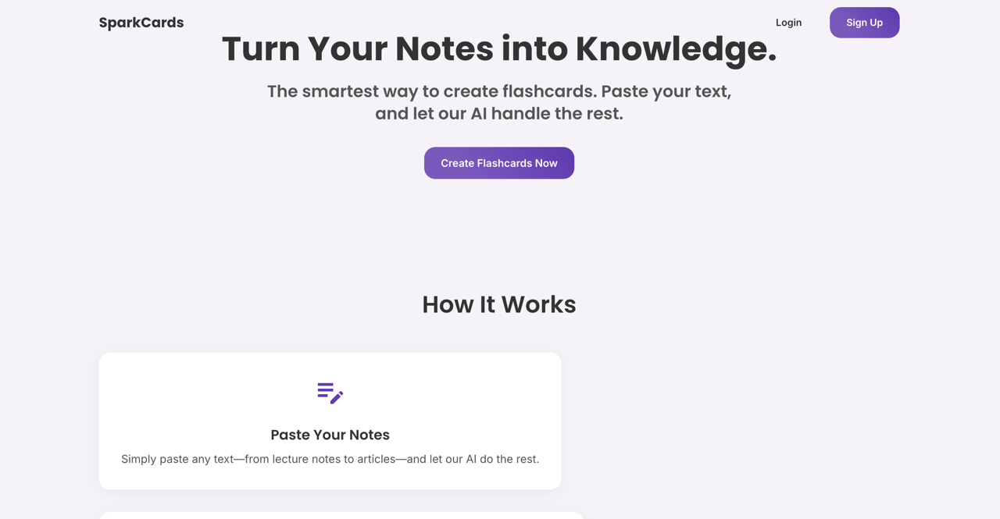

# SparkCards

A full-stack SaaS that turns notes or any block of text into study flashcards using Google Gemini. Built with Next.js, with Clerk for authentication, Firestore for storage, and Stripe Checkout for subscription billing.

I built this as a computer science student because I thought it would be a useful study tool for myself. Making flashcards from my notes automatically is a lot faster than writing them all out by hand.

**Live demo:** https://flashcard-saas-project.vercel.app/



## Features
- Generates a 10-card deck from pasted text using the Gemini API
- Prompts the model for strict JSON and parses it defensively, so a malformed response doesn't break the UI
- Saves decks to your account in Firestore and shows them in a flip-card study view
- Clerk handles sign-in and sign-up; Stripe Checkout runs a $5/month Pro subscription

## Tech stack
- Next.js (App Router) and React
- Google Gemini API
- Clerk for authentication
- Firebase / Firestore for storage
- Stripe Checkout for billing
- MUI for the interface

## Running locally
1. Install dependencies:
   ```bash
   npm install
   ```
2. Create a `.env.local` file with your keys:
   ```
   GEMINI_API_KEY=your_gemini_key
   NEXT_PUBLIC_CLERK_PUBLISHABLE_KEY=your_clerk_key
   CLERK_SECRET_KEY=your_clerk_secret
   NEXT_PUBLIC_STRIPE_PUBLIC_KEY=your_stripe_public_key
   STRIPE_SECRET_KEY=your_stripe_secret_key
   # plus your Firebase config (NEXT_PUBLIC_FIREBASE_API_KEY, etc.)
   ```
3. Start the dev server:
   ```bash
   npm run dev
   ```
4. Open http://localhost:3000 in your browser.
